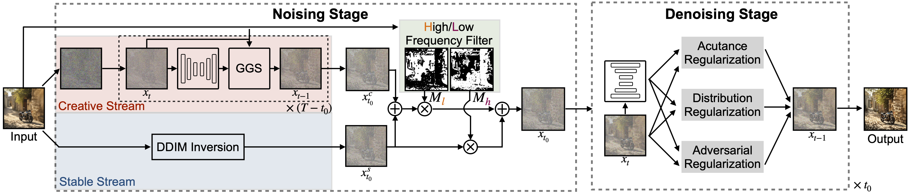

Implementation of FreeEnhance. For details, see **[FreeEnhance: Tuning-Free Image Enhancement via Content-Consistent Noising-and-Denoising Process](https://arxiv.org/abs/2409.07451)**.

<div align="center">
  
</div>

Please install [PyTorch](https://pytorch.org/) and download the [HPSv2](https://huggingface.co/datasets/ymhao/HPDv2) dataset. This codebase has been developed with python version 3.8, PyTorch version 2.2, CUDA 11.3 and diffusers 0.29.2. 

###  Single-node generating
Run FreeEnhance with SDXL on a single GPU with the following command.
```
python main_freeEnhance.py \
--do_in_sbs \
--blend_func 'additionEx' 'addition' \
--blend_fac 'cst' 'retouch' \
--xt_tau 0.6 \
--xt_type over_noising \
--xt_retouch_k 3 \
--do_dps \
--do_enhance \
--enhance_deblur_scale  0.3 \
--e_d_ex \
--enhance_sharpen_scale 4 \
--enhance_var 20 \
--output_dir /path_to_output \
--data_path /path_to_HPDv2/SDXL-base-0.9/photo \
--ckpt /path_to_sdxl/models--stabilityai--stable-diffusion-xl-base-1.0/ \
```
